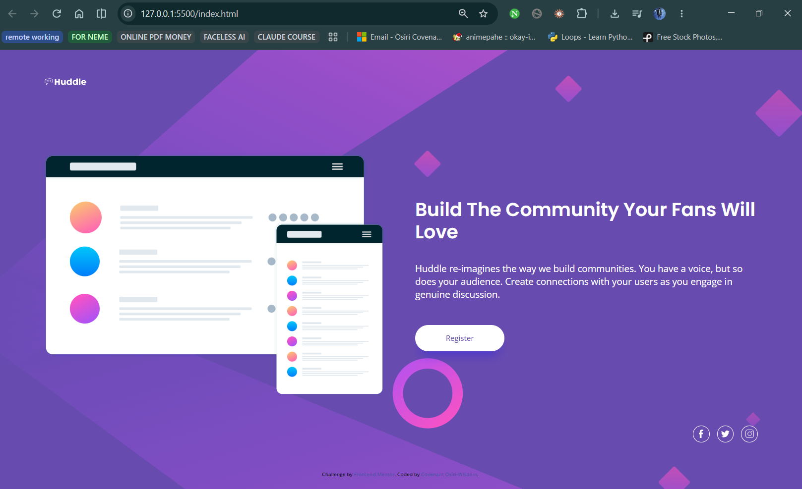

# Frontend Mentor - Huddle landing page with single introductory section solution

This is a solution to the [Huddle landing page with single introductory section challenge on Frontend Mentor](https://www.frontendmentor.io/challenges/huddle-landing-page-with-a-single-introductory-section-B_2Wvxgi0). Frontend Mentor challenges help you improve your coding skills by building realistic projects.

## Table of contents

- [Overview](#overview)
  - [The challenge](#the-challenge)
  - [Screenshot](#screenshot)
  - [Links](#links)
- [My process](#my-process)
  - [Built with](#built-with)
  - [What I learned](#what-i-learned)
  - [Continued development](#continued-development)
  - [Useful resources](#useful-resources)
  - [AI Collaboration](#ai-collaboration)
- [Author](#author)

## Overview

### The challenge

Users are able to:

- View the optimal layout for the page depending on their device's screen size
- See hover states for all interactive elements on the page

### Screenshot



### Links

- Solution URL: [Add solution URL here](https://github.com/covenantosiri-wisdom/huddle-landing-page-with-single-introductory-section)
- Live Site URL: [Add live site URL here](https://huddle-landing-page-with-single-int-teal.vercel.app/)

## My process

### Built with

- Semantic HTML5 markup
- [Tailwind CSS v4](https://tailwindcss.com/) (via the CDN browser build)
- Tailwind's `@theme` directive for custom design tokens (colors, fonts, background images)
- Flexbox for layout
- Mobile-first responsive workflow
- Google Fonts - Poppins & Open Sans

### What I learned

This build centers on a single-breakpoint responsive layout (mobile default → `md:` for desktop) done entirely with Tailwind utility classes, with no custom CSS file needed beyond the theme setup.

**Registering custom design tokens with `@theme`**

Rather than reaching for a `tailwind.config.js`, the CDN browser build lets you declare custom colors, fonts, and even background images directly in a `<style type="text/tailwindcss">` block:

```css
@theme {
  --font-poppins: "Poppins", sans-serif;
  --font-open-sans: "Open Sans", sans-serif;
  --color-purple-700: hsl(257, 40%, 49%);
  --color-magenta-400: hsl(300, 69%, 71%);
  --background-image-desktop-bg: url('./images/bg-desktop.svg');
  --background-image-mobile-bg: url('./images/bg-mobile.svg');
}
```

This immediately unlocks utility classes like `bg-purple-700`, `font-poppins`, and `bg-mobile-bg`/`bg-desktop-bg` elsewhere in the markup.

**Swapping assets and behavior at the breakpoint**

The background SVG, its sizing behavior, and the whole page's flex direction all flip together at the `md:` breakpoint:

```html
<body class="bg-mobile-bg md:bg-desktop-bg bg-no-repeat bg-contain md:bg-cover ...">
```

```html
<main class="flex flex-col items-center ... md:flex-row md:items-center ...">
```

On mobile, content stacks vertically and centers; on desktop, the illustration and text sit side by side and left-align.

**Hover states and transitions**

Interactive elements (the Register button and the social icons) use Tailwind's `hover:` variants together with `transition` so state changes animate smoothly instead of snapping:

```html
<button class="... hover:bg-magenta-400 hover:text-white transition ...">Register</button>
```

**Accessible icon-only links**

The social links contain only inline SVGs, so each one gets an `aria-label` (e.g. `aria-label="Facebook"`) to stay accessible to screen readers.

### Continued development

- Match spacing, font sizes, and the shadow under the Register button more precisely against the provided JPG designs
- Move repeated hover/transition utility strings into a small set of reusable classes to reduce duplication
- Consider a proper Tailwind build step (instead of the CDN script) for production use

### Useful resources

- [Tailwind CSS v4 docs](https://tailwindcss.com/docs) - Reference for the `@theme` directive and utility classes used throughout this build.
- [MDN: ARIA labels](https://developer.mozilla.org/en-US/docs/Web/Accessibility/ARIA/Attributes/aria-label) - Used to confirm the right way to label icon-only links.

### AI Collaboration

- **Tool used:** Claude
- **How it was used:** Assisted with structuring the Tailwind `@theme` setup, working through the mobile → desktop breakpoint logic for the background image and layout direction, and adding accessible hover states to the interactive elements.
- **What worked well:** Explaining *why* a given utility combination produces the responsive behavior, rather than just handing over finished markup.

## Author

- Frontend Mentor - [Add your Frontend Mentor username here](https://www.frontendmentor.io/profile/covenantosiri-wisdom)
- Coded by Covenant Osiri-Wisdom
